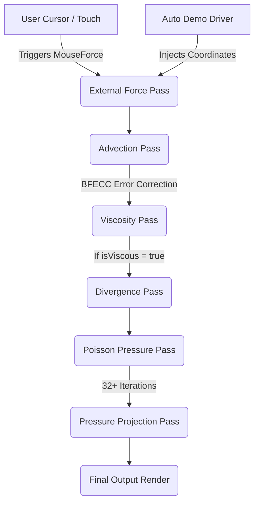

# 🌊 Liquid Ether Background Mouse Interaction

A premium, high-performance interactive WebGL fluid simulation background component for React applications. Powered by **Three.js** and raw WebGL shaders, it creates a gorgeous, responsive liquid canvas that reacts to mouse/touch interactions and drives self-running animations when idle.

---

## 📸 Preview

![Liquid Ether Fluid Simulation Background Preview] 


---

## ✨ Features

- **🎨 Multi-Stop Color Palettes:** Dynamic texture mapping translates fluid velocity fields into gradient color transitions defined by your custom array of colors.
- **⚡ GPU Accelerated:** Fully simulated on the GPU using custom shaders (Advection, Viscosity, Divergence, Poisson Pressure, and External Forces) and custom Framebuffer Objects (FBOs).
- **🤖 Autonomous Demo Driver:** Randomly injects virtual inputs to showcase the fluid effect dynamically when the user is inactive.
- **💨 User Takeover & Handoff:** Instantly pauses the auto-driver and interpolates coordinates to the user's cursor when interaction is detected, resuming smoothly after inactivity.
- **⚙️ Advanced Physics Engine Configuration:** Deeply customizable settings for viscous friction, cursor brush size, time-step delta, numerical error correction (BFECC), grid resolution, and border bounce.
- **🔋 Performance & Memory Optimized:** 
  - Automatically pauses rendering loops using `IntersectionObserver` when the component is offscreen.
  - Listens to document visibility state to sleep when browser tabs are inactive.
  - Safely handles contexts and GPU cleanups on unmount.
- **📐 Fully Responsive:** Continuously adjusts to browser window changes using `ResizeObserver` with requestAnimationFrame throttling.

---

## 🚀 Getting Started

### 1. Install Dependencies
Make sure you have the core packages installed in your React project:
```bash
npm install three
```

### 2. Add the Component
Ensure you have the `LiquidEther.jsx` file imported into your React components directory.

### 3. Usage Example
To display the background full-screen or inside a card container, ensure the parent container has a defined width/height and `position: relative`.

```jsx
import React from 'react';
import LiquidEther from './components/LiquidEther';

function HeroSection() {
  return (
    <div className="relative w-full h-screen bg-slate-950 overflow-hidden">
      {/* Background Liquid Component */}
      <LiquidEther
        colors={['#5227FF', '#FF9FFC', '#B497CF']}
        mouseForce={22}
        cursorSize={110}
        isViscous={true}
        viscous={25}
        resolution={0.5}
        autoDemo={true}
        autoSpeed={0.6}
        autoIntensity={2.5}
      />

      {/* Foreground Content */}
      <div className="absolute inset-0 flex flex-col items-center justify-center pointer-events-none z-10">
        <h1 className="text-6xl font-bold text-white tracking-wider select-none">
          LIQUID ETHER
        </h1>
        <p className="mt-4 text-slate-300 text-lg select-none">
          Move your mouse to interact with the space.
        </p>
      </div>
    </div>
  );
}

export default HeroSection;
```

---

## 🎛️ Component API (Props Reference)

| Prop | Type | Default | Description |
| :--- | :--- | :--- | :--- |
| **`colors`** | `String[]` | `['#5227FF', '#FF9FFC', '#B497CF']` | Array of hex color strings mapped to the velocity magnitude (low velocity maps to left colors, high velocity to right colors). |
| **`mouseForce`** | `Number` | `20` | Power multiplier applied to the fluid's velocity field by cursor/touch movement. |
| **`cursorSize`** | `Number` | `100` | Brush radius of the interaction force. |
| **`isViscous`** | `Boolean` | `false` | Enables the viscosity solver. Adds friction/drag to slow down fluid momentum over time. |
| **`viscous`** | `Number` | `30` | Viscosity coefficient (only applies if `isViscous` is `true`). |
| **`iterationsViscous`**| `Number` | `32` | Relaxation iterations for the viscosity solver. Higher = more accurate viscosity, but higher GPU cost. |
| **`iterationsPoisson`**| `Number` | `32` | Relaxation iterations for the Poisson pressure solver. Solves fluid incompressibility. |
| **`dt`** | `Number` | `0.014` | Delta time step size per simulation frame. |
| **`BFECC`** | `Boolean` | `true` | Enables Back and Forth Error Compensation and Correction for advection, preserving fine eddies, details, and swirls. |
| **`resolution`** | `Number` | `0.5` | Resolution scaling factor of the WebGL Framebuffer Objects relative to container pixels. (e.g., `0.5` runs at half-resolution for massive speedups). |
| **`isBounce`** | `Boolean` | `false` | If `true`, fluid velocities bounce off boundaries. If `false`, they wrap around container edges. |
| **`autoDemo`** | `Boolean` | `true` | Enables the idle autonomous driver that animates the fluid when user is inactive. |
| **`autoSpeed`** | `Number` | `0.5` | Movement speed of the automatic simulator cursor. |
| **`autoIntensity`** | `Number` | `2.2` | Force intensity applied by the automatic simulator cursor. |
| **`takeoverDuration`** | `Number` | `0.25` | Duration (in seconds) to transition mouse control from the auto-driver back to the user upon hover. |
| **`autoResumeDelay`** | `Number` | `1000` | Inactivity delay (in milliseconds) before the auto-driver starts animating again. |
| **`autoRampDuration`** | `Number` | `0.6` | Time (in seconds) taken for the auto-driver to ramp up to full force upon resuming. |
| **`style`** | `Object` | `{}` | Inline CSS styles applied to the outer wrapper container. |
| **`className`** | `String` | `""` | Additional CSS class names applied to the container wrapper. |

---

## 🧠 Simulation Inner-workings

The simulation is built on standard Eulerian fluid dynamics and utilizes a multi-pass Shader pipeline running on WebGL:



1. **Advection (`advection_frag`):** Moves the velocity field along itself. When BFECC is active, it performs double-sampling (forward and backward steps) to cancel out numerical diffusion, ensuring detailed micro-eddies are preserved.
2. **External Force (`externalForce_frag`):** Maps mouse coordinates and applies linear forces based on the movement delta vector into the velocity buffer.
3. **Viscosity (`viscous_frag`):** Solves the diffusion term using a Jacobi relaxation loop (`iterationsViscous` times), applying internal drag friction to the fluid.
4. **Divergence (`divergence_frag`):** Computes divergence in the velocity field.
5. **Poisson Pressure Solver (`poisson_frag`):** Solves Poisson equations (`iterationsPoisson` times) to compute the pressure field required to keep the fluid incompressible.
6. **Pressure Projection (`pressure_frag`):** Subtracts the pressure gradient from the velocity field, yielding a divergence-free (incompressible) velocity output.
7. **Color Mapping Output (`color_frag`):** Computes the velocity magnitude at each pixel and maps it directly onto the 1D palette texture generated from your `colors` prop.

---

## ⚡ Performance Tuning Guidelines

To ensure stable frame rates across all client devices:

> [!TIP]
> **Resolution is the most effective lever:** Keep `resolution` at `0.5` or `0.6`. This reduces the fragment shader count to 25–36% of the screen pixel count, which dramatically speeds up processing on mobile devices, integrated GPUs, and high-DPI screens without noticeable loss in visual quality due to the fluid's naturally smooth, blurred gradients.

> [!NOTE]
> **Iteration Settings:** Reducing `iterationsPoisson` (e.g., to `16` or `20`) or disabling viscosity (`isViscous={false}`) will yield significant rendering performance boosts on older devices.

---

